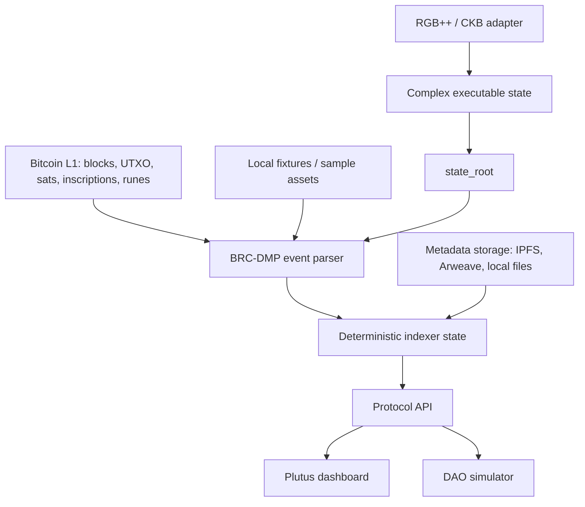

# Architecture

## Phase 0 / 1 Boundary

The initial codebase is deliberately small:

- Local fixtures replace live Bitcoin scans.
- The schema layer defines event grammar and deterministic hashing rules.
- The indexer builds DMO state and exposes a stable state root.
- The API makes the indexed state inspectable.
- The web app is a thin dashboard for protocol state, not a marketplace yet.

## Layers

### Protocol Schema

Owns the event grammar, allowed asset kinds, allowed operations, trust dimensions, and canonical hashing helpers.

### Indexer

Reads validated events in deterministic order and builds DMO state:

- ownership
- metadata versions
- proof chain
- trust vector
- Agent DID wallet state
- key rotations and permission policy
- interaction privacy levels
- fractionalization plans
- external state anchors
- interaction proofs
- event history

### API

Exposes the state needed by a first Plutus MVP:

- `GET /health`
- `GET /assets`
- `GET /assets/:id`
- `GET /assets/:id/proofs`
- `GET /assets/:id/trust`
- `GET /assets/:id/interactions`
- `GET /assets/:id/agent`
- `GET /assets/:id/did`
- `GET /agents`
- `GET /interactions`
- `GET /dao/summary`
- `GET /events`
- `GET /state-root`

### Web

Uses the API to inspect assets, proof chains, agent identities, and interaction proofs.

## Future Adapters

Bitcoin / Ordinals adapter:

- scan inscriptions or OP_RETURN payloads
- extract `brc-dmp` JSON
- normalize event order by block height, transaction index, and inscription order

RGB++ / CKB adapter:

- map a DMO to one or more CKB cells
- track fractions, locks, auctions, and revenue rights
- emit `anchor_state` events back into Bitcoin-rooted history
